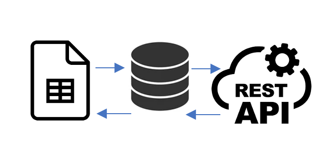

A customer would like to have a web application that displays a contact list.

The data consists of:

- Firstname;
- Lastname;
- Street;
- Zip;
- City;
- Image;

The data set is hosted in Google Docs as a spreadsheet

The customer is responsible for the contents of this spreadsheet and therefore, the data is
not always reliable. For example, the size of the images is not guaranteed to be optimized
for use in a responsive web application.

Suppose a condition that a new request of using Google data sheet has been received for instance by sending request to data sheet downloading service or in the beginning of the program when the previous Google data sheets have to be considered. To improve the performance of this solution, all the rows of the data sheet will be considered one by one or individually and asynchronously. Now they must be validated. In order to validate all the images per row, a stream system has been used and only the first 1000 bytes of every image will be read and with the help of Pillow libraries and those 1000 bytes, format and size of the image will be recognized. If all the information was valid, data will be stored in the in-memory database. 
It must be mentioned that if any request of contracts may be received by get contract service, all the processed contracts from the first to the last one can be available to be downloaded. 